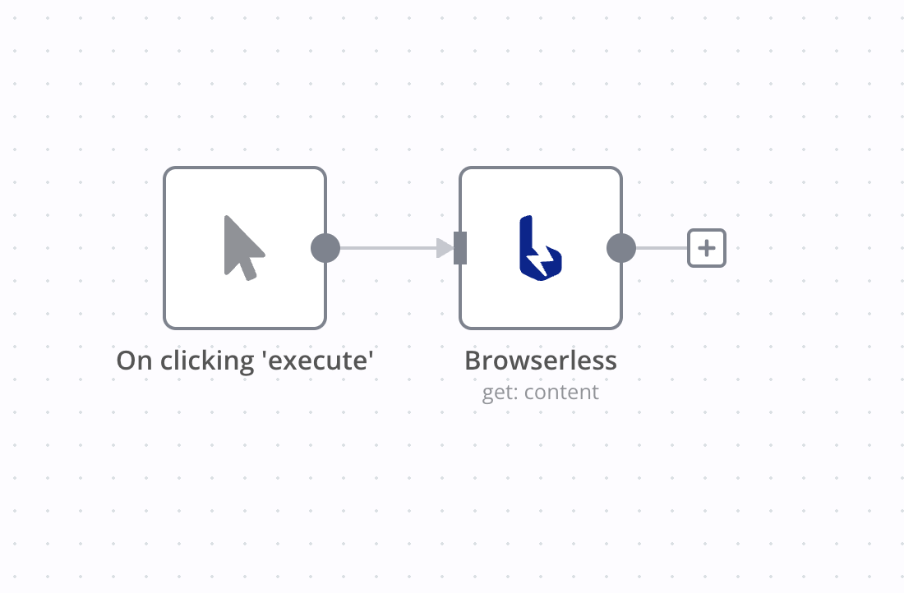
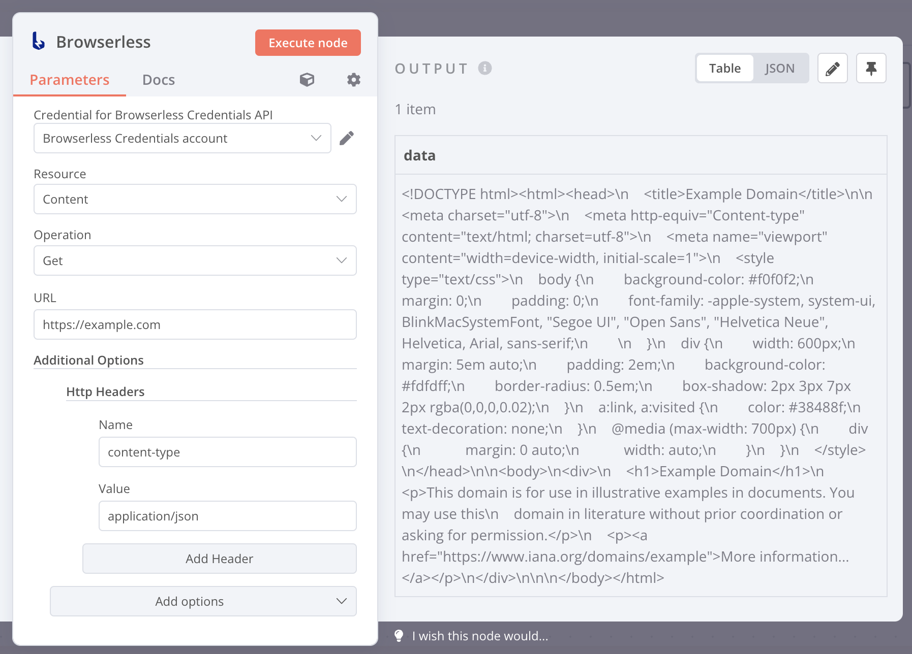
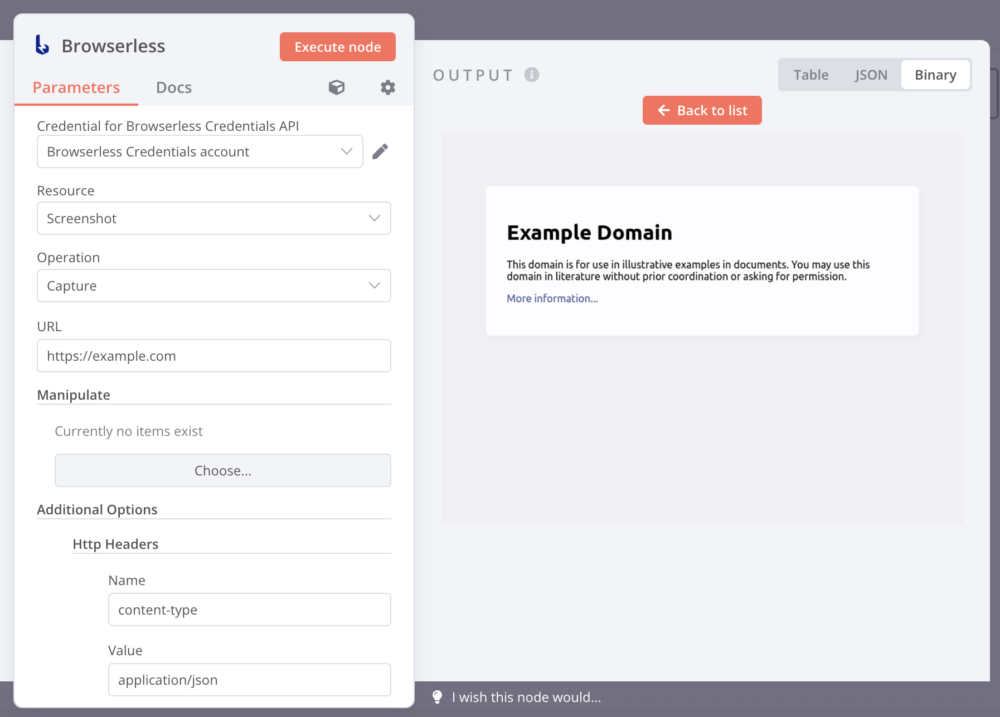
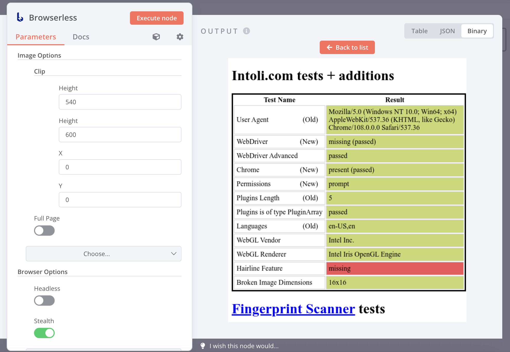

# n8n-nodes-browserless

<p align="center">
  
</p>

#### New Updates: 🎉 **Browserless** API V2 is now supported.

This is an n8n community node that allows you to interact with a [browserless](https://github.com/browserless/chrome) instance in your `n8n` workflows.

**Browserless** is a web service that enables remote clients to connect, drive, and execute headless tasks, all within Docker. It provides first-class integrations for Puppeteer, Playwright, Selenium WebDriver, and several REST APIs for common tasks. Additionally, it addresses common issues like missing system fonts, external libraries, and performance improvements. It even handles tasks such as downloading files, managing sessions, and includes a fully-featured documentation site.

If you’ve struggled with setting up Chrome in Docker or scaling headless workloads, browserless is designed for you.

If you’ve been trying to automate browser-related tasks like `web scraping`, `browser automation`, `end-to-end testing`, or `PDF generation` with `n8n` and want to avoid dealing with browser infrastructure, the `n8n-nodes-browserless` will make your life easier.

[n8n](https://n8n.io/) is a [fair-code licensed](https://docs.n8n.io/reference/license/) workflow automation platform.

## Table of Contents

[Installation](#installation)  
[Operations](#operations)  
[Credentials](#credentials)  
[Compatibility](#compatibility)  
[Usage](#usage)  
[Resources](#resources)  
[Version history](#version-history)  

## Highlights

- [x] Full control over Browserless
- [x] Cloud compatibility
- [x] Docker support by default
- [x] Live browser debugging
- [x] JavaScript injection
- [x] Dynamic page rendering
- [x] PDF download
- [x] Screenshot capture
- [x] Custom code execution

## Installation

1. [Install Docker](https://docs.docker.com/engine/install/)
2. [Install Browserless](https://docs.browserless.io/docs/docker-quickstart.html)

```shell
$ docker run \
  --rm \
  -p 3000:3000 \
  -e "CONCURRENT=10" \
  -e "TOKEN=6R0W53R135510" \
  ghcr.io/browserless/chromium
```

3. Visit your n8n instance > Settings > Community Nodes > Install `n8n-nodes-browserless`.
4. Set up Browserless credentials with the URL `http://localhost:3000` and your secure token.
5. Add the Browserless node to your workflow by searching for `browserless`.
6. Start using Browserless in your n8n workflows!

Follow the [installation guide](https://docs.n8n.io/integrations/community-nodes/installation/) in the n8n community nodes documentation.

## Operations

- [Get page content](https://www.browserless.io/docs/content)
- [Execute custom function](https://www.browserless.io/docs/function)
- [Generate PDF of a page](https://www.browserless.io/docs/pdf)
- [Capture page screenshot](https://www.browserless.io/docs/screenshot)
- [Scrape page as JSON](https://www.browserless.io/docs/scrape)

## Credentials

This node requires a Browserless `URL` and `token` to connect to your Browserless account or a self-hosted Browserless instance.


## Compatibility

This node was developed on `n8n@0.200.1`. It hasn't been tested on other versions yet.

## Usage

1. Add the `browserless` node to your workflow.
   
2. Configure your node.
   
   
   

## Anti-Bot Detection

With strong support from Browserless, you can implement robust anti-bot detection using the following setup:

- `Browser Options` > `Stealth` On
- `Browser Options` > `Headless` Off



## Resources

* [n8n Community Nodes Documentation](https://docs.n8n.io/integrations/community-nodes/)
* [Browserless Homepage](https://www.browserless.io/)
* [Browserless API Documentation](https://www.browserless.io/docs/api)
* [Browserless Self-Hosted Quick Start](https://www.browserless.io/docs/docker-quickstart)

## Version History

- `0.0.1` Initial release
- `0.2.0` Fixed common issues
- `0.3.0` Fixed [#1](https://github.com/minhlucvan/n8n-nodes-browserless/issues/1), added tests
- `0.4.0` Added browser options, set no-cache as the default header
- `0.5.0` Implemented anti-bot detection
- `1.0.0` Added support for `browserless` API v2
